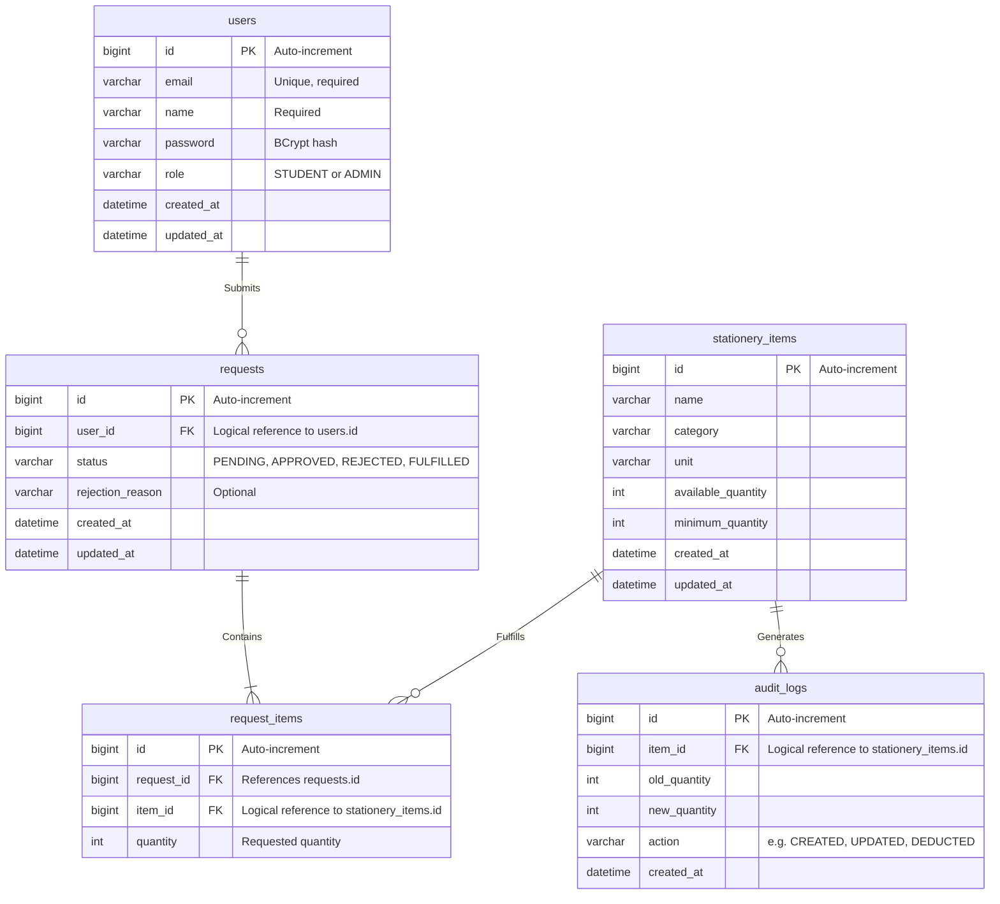

# Database Schema Documentation

This document describes the relational database design for the Stationery Management System, spanning across the `auth_db`, `inventory_db`, and `request_db` schemas.

## Entity Relationship Diagram (ERD)

The following Mermaid diagram maps out the logical relationships of the tables across the microservices. Note that because each service has its own independent database schema, the relationships are maintained logically (via API IDs and foreign key references at the application layer) rather than through hard foreign key constraints in a monolith database.

## Schema Details

### 1. auth_db
Managed by the **Auth Service**.
- **users**: Stores student and admin credentials. Passwords are encrypted using BCrypt. Emails must be unique. The `role` column drives the application's Role-Based Access Control (RBAC).

### 2. inventory_db
Managed by the **Inventory Service**.
- **stationery_items**: The catalog of items. `available_quantity` tracks current stock, and `minimum_quantity` triggers low-stock alerts.
- **audit_logs**: An immutable ledger of inventory changes. Automatically records when an item is created, updated, or when its quantity is deducted due to an approved student request.

### 3. request_db
Managed by the **Request Service**.
- **requests**: The parent record of a student's stationery requisition. Tracks the status (`PENDING`, `APPROVED`, `REJECTED`, `FULFILLED`) and optional `rejection_reason`. Logically linked to `auth_db.users` via `user_id`.
- **request_items**: A one-to-many child table of `requests`. Enables a single request to ask for multiple distinct items simultaneously. Logically linked to `inventory_db.stationery_items` via `item_id`.
